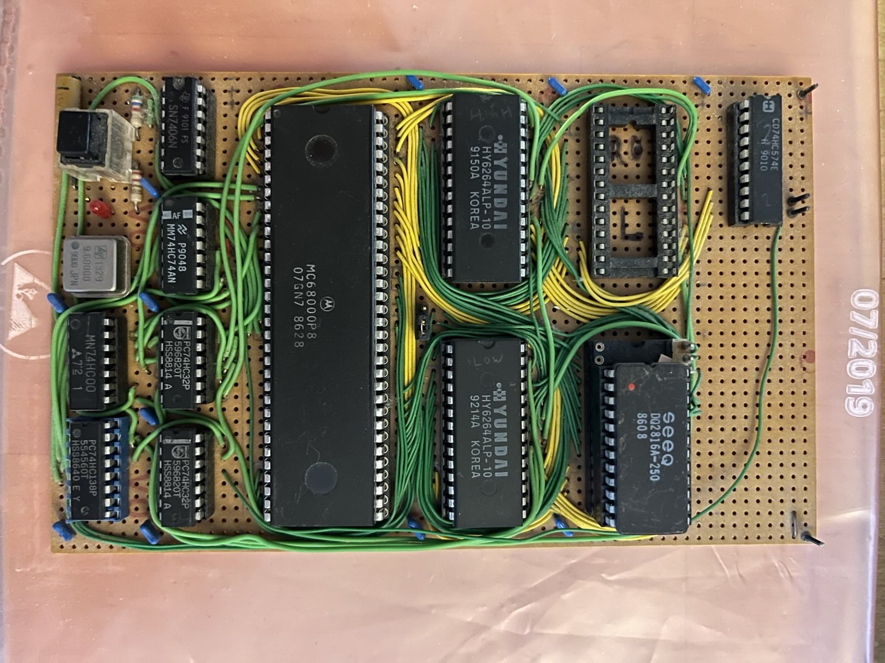

# MC68000 Single Board Computer

## Updates
### 2025-09-16 
- Searched for the circuit board in old moving boxes and found it. 
- Reverse engineering of the circuit diagram and drawing in Kicad.

#### Reverse engineering facts
- MC68000 CPU running at 4.8MHz
- 1MB mapped from 0x000000 to 0x0fffff for RAM. (2x8kb 6264 static RAM)
- 1MB mapped from 0x100000 to 0x1fffff for ROM. (2x2kb 2816 EEPROM. Only the high byte EEPROM is still installed.)
- 1MB mapped from 0x200000 to 0x2fffff for IO. (One 74HC574 Latch for 8-bit output)
- During reset the ROM is remapped to 0x000000 so that the initial SP and PC can be loaded from ROM. Any read operation which triggers A23 to high disables the remapping of the ROM and the normal memory map is activated until the next reset.

### 2025-09-18
- Searched for second 2816 in old moving boxes. Found one in an other old sbc project. Since this is not the missing low byte EEPROM, there is no change to test the 68000 without writing new code first.
